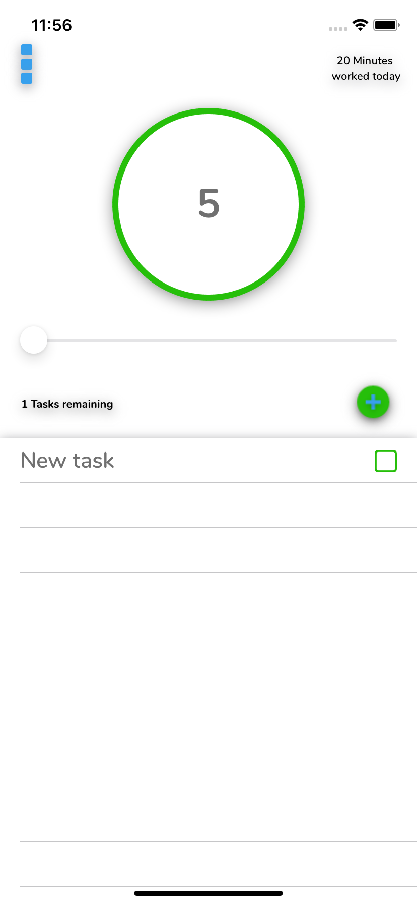
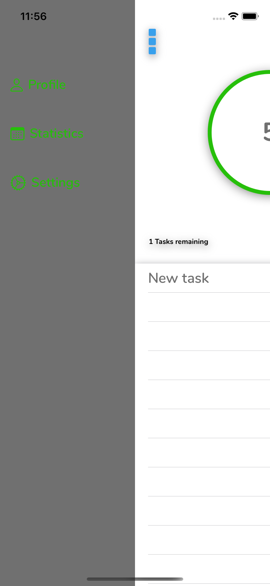
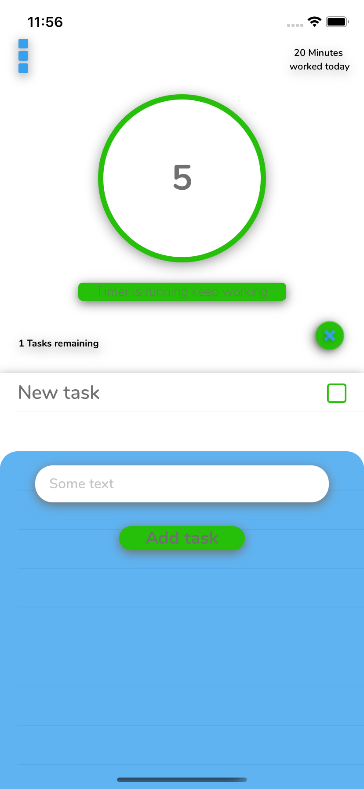

# TaskTimer

An iOS application, where you can add your tasks and set a timer while you work on them. If the the timer is finished you
get your worked time added your previous time. If you reach milestones (50 hours of work for example) you will get rewards

!! Still in progress !!

# What I Learned

* Working with UserDefaults
* Working wiht NSFetchResults 
* Working with Core Data(Entitys, Relationships)
* Working with Animations
* Working wiht pop-up views
* Diffrent types of menus

      

